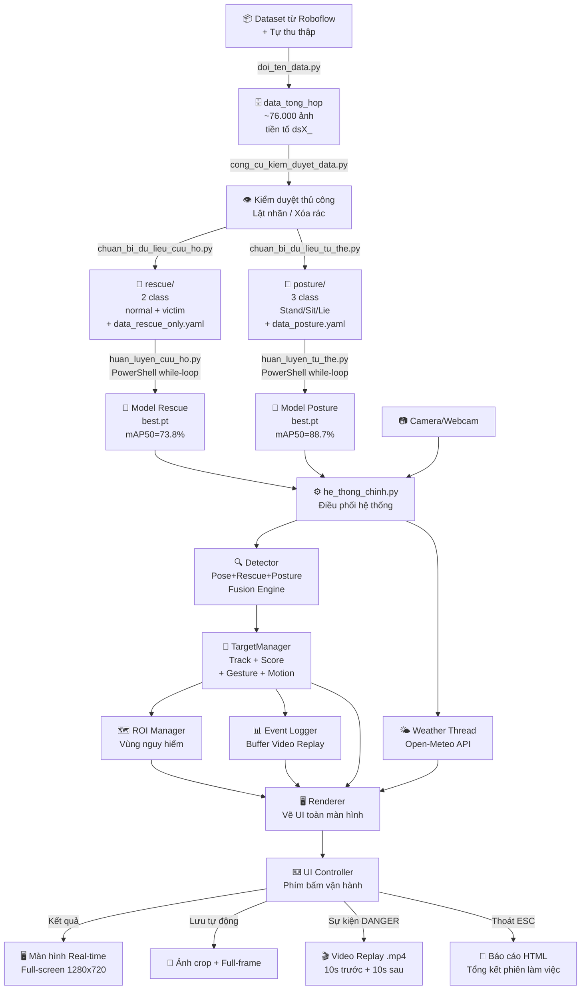

# TỔNG QUAN TOÀN BỘ DỰ ÁN — TRẠM MẶT ĐẤT AI TÍCH HỢP

> [!NOTE]
> Tài liệu này đã được đối chiếu và xác nhận chính xác theo code thực tế. Mỗi mục đều ghi rõ **file nguồn + dòng code** để truy xuất khi viết báo cáo.
## (Ground Control Station với AI Nhận Diện Nạn Nhân Cứu Hộ)

> [!IMPORTANT]
> Tài liệu này là **form lộ trình đầy đủ** của toàn bộ dự án — từ bước thu thập dữ liệu thô cho đến khi hệ thống xuất kết quả ra màn hình, video replay và báo cáo PDF. Anh dùng làm khung để viết báo cáo đồ án, điền số liệu thực vào các chỗ `[...]`.

---

# PHẦN 1 — THU THẬP & CHUẨN BỊ DỮ LIỆU

## 1.1 Nguồn Dữ Liệu

Dự án sử dụng **[X] bộ dataset** được thu thập từ nhiều nguồn khác nhau:

- **Roboflow Universe**: Tải các bộ dataset công khai về người trong tình huống cứu hộ, thiên tai, ảnh UAV/drone
- **Dataset tự thu thập**: Ghi hình Webcam trong môi trường phòng lab với các tư thế đứng/ngồi/nằm có kiểm soát
- **Dữ liệu tổng hợp**: [X] bộ dataset với tổng cộng **[~76.000] ảnh** được gộp lại vào thư mục trung tâm `data_train_AI/data_tong_hop/`

### Quy ước đặt tên Dataset

Mỗi bộ dataset sau khi tải về được gán một **mã tiền tố duy nhất** để tránh xung đột tên file:

| Nhóm | Mã tiền tố | Loại dữ liệu |
|---|---|---|
| Rescue (Cứu hộ) | `ds0_` → `ds17_` | Ảnh người trong đổ nát, thiên tai, góc nhìn UAV |
| Posture (Tư thế) | `dsA_` → `dsI_` | Ảnh người đứng, ngồi, nằm trong môi trường kiểm soát |

### Công cụ: `doi_ten_data.py`

Chức năng: Nhận đường dẫn thư mục dataset vừa giải nén + mã tiền tố → Tự động đổi tên và copy toàn bộ file ảnh + nhãn vào `data_tong_hop/train/` và `data_tong_hop/valid/`.

```
[Dataset Roboflow .zip]
        ↓ giải nén
[Thư mục gốc: images/ + labels/]
        ↓ doi_ten_data.py (gán tiền tố dsX_)
[data_tong_hop/train/images/dsX_*.jpg]
[data_tong_hop/train/labels/dsX_*.txt]
```

---

## 1.2 Kiểm Duyệt & Làm Sạch Nhãn

### Công cụ: `cong_cu_kiem_duyet_data.py`

Đây là công cụ **kiểm duyệt thủ công bằng mắt người** — giao diện OpenCV hiển thị từng ảnh cùng bounding box, người dùng nhìn và ra lệnh qua bàn phím:

| Phím | Hành động |
|---|---|
| `F` | Lật class (0↔1) — dùng cho Rescue dataset |
| `1` / `2` / `3` | Gán class Đứng/Ngồi/Nằm — dùng cho Posture dataset |
| `Space` | Bỏ qua, ảnh tiếp theo |
| `E` | Quay lại ảnh trước |
| `X` | Xóa ảnh rác (xóa cả ảnh lẫn nhãn) |
| `Q` / `ESC` | Lưu tiến trình và thoát |

> [!NOTE]
> Tiến trình kiểm duyệt được lưu vào file `review_progress_dsX.json` để có thể tiếp tục từ lần trước mà không cần xem lại từ đầu.

> [!WARNING]
> Tool này chỉ sửa nhãn trong `data_tong_hop`. Sau khi kiểm duyệt xong PHẢI chạy lại file chuẩn bị dữ liệu để đồng bộ nhãn mới sang thư mục train chuyên biệt.

---

## 1.3 Lọc & Gom Dữ Liệu Chuyên Biệt

### 1.3.1 Cho Model Cứu Hộ: `chuan_bi_du_lieu_cuu_ho.py`

**Đầu vào:** `data_tong_hop/` (toàn bộ ~76.000 ảnh, nhiều class lẫn lộn)
**Đầu ra:** `data_train_AI/rescue/` (chỉ giữ 2 class cứu hộ)

Quy trình lọc:
1. Quét các file nhãn có tiền tố `ds0_` → `ds17_` (18 bộ data Rescue)
2. Chỉ giữ lại nhãn có `class_id = 0` (normal_person) hoặc `class_id = 1` (victim)
3. Copy file ảnh + nhãn đã lọc sang `rescue/train/` và `rescue/valid/`
4. Tự động xuất file cấu hình `data_rescue_only.yaml`:
   - `nc: 2`
   - `names: [normal_person, victim]`
   - `train: .../rescue/train/images`
   - `val: .../rescue/valid/images`

### 1.3.2 Cho Model Tư Thế: `chuan_bi_du_lieu_tu_the.py`

**Đầu vào:** `data_tong_hop/`
**Đầu ra:** `data_train_AI/posture/` (3 class tư thế)

Quy trình lọc + remapping class:
1. Quét các file có tiền tố `dsA_` → `dsI_` (8 bộ data Posture)
2. Chỉ giữ `class_id = 1, 2, 3` → **Remapping về 0-indexed**: 1→0, 2→1, 3→2
3. Xuất `data_posture.yaml`:
   - `nc: 3`
   - `names: [Stand, Sit, Lie]`

---

# PHẦN 2 — HUẤN LUYỆN MÔ HÌNH AI

## 2.1 Kiến Trúc Model

Dự án sử dụng **YOLOv8s** (Small variant) làm backbone cho cả 3 model chuyên biệt:

| Model | File | Nhiệm vụ | Số class | Best mAP50 |
|---|---|---|---|---|
| **YOLOv8-Pose** | `yolov8n-pose.pt` | Phát hiện người + 17 keypoints | 1 (person) | (Pretrained COCO) |
| **YOLOv8-Rescue** | `Model/Rescue/weights/best.pt` | Phân loại Nạn nhân / Người bình thường | 2 | **[0.738]** |
| **YOLOv8-Posture** | `Model/Posture/weights/best.pt` | Phân loại Đứng / Ngồi / Nằm | 3 | **[0.887]** |

## 2.2 Cơ Chế Train Tự Động (Chống Tràn VRAM)

Do GPU VRAM bị rò rỉ bộ nhớ khi train nhiều epoch liên tục, hệ thống sử dụng cơ chế **ngắt-nối tự động** độc đáo:

```
PowerShell: while ($true) { python huan_luyen_X.py → nếu ExitCode=42 thì STOP }
                ↓
Python script:  Sau mỗi Epoch → ghi log → sys.exit(0)  [xả VRAM]
                ↓
PowerShell:     Gọi lại Python → Python đọc last.pt → resume từ epoch trước
                ...lặp lại đến Epoch 50...
                ↓ Epoch 50 xong → sys.exit(42)
PowerShell:     Nhận ExitCode=42 → BREAK → Hoàn tất
```

**Log giám sát** được ghi vào `train_rescue_monitor.log` / `train_posture_monitor.log` với định dạng:
```
[MONITOR] Epoch X Xong | RAM: XX% | VRAM Allocated: 0.26GB | mAP50: 0.XXXX
```

## 2.3 Thông Số Huấn Luyện

| Tham số | Giá trị |
|---|---|
| Kiến trúc | YOLOv8s |
| Epochs | 50 |
| Image size | 640×640 |
| Batch size | 4 |
| Device | GPU (CUDA) |
| Optimizer | Auto (AdamW) |
| Patience (Early stop) | 20 epochs |
| Augmentation | Mosaic, Flip LR, HSV |
| Cache | False (tiết kiệm RAM) |

## 2.4 Kết Quả Huấn Luyện Thực Tế

### Model Rescue (best.pt — Epoch 50):
| Metric | Giá trị |
|---|---|
| Precision | 85.9% |
| Recall | 66.5% |
| mAP50 | 73.8% |
| F1-score ≈ | 75.0% |

### Model Posture (best.pt — Epoch 50):
| Metric | Giá trị |
|---|---|
| Precision | 88.3% |
| Recall | 87.6% |
| mAP50 | 88.7% |
| F1-score ≈ | 88.0% |

---

# PHẦN 3 — HỆ THỐNG CHÍNH (THỜI GIAN THỰC)

## 3.1 Tổng Quan Kiến Trúc Hệ Thống

```
[Camera/Webcam]
      ↓ frame
[he_thong_chinh.py] ← Điều phối tổng thể
      ↓
  ┌───────────────────────────────────────────────────────┐
  │  Luồng 1: Detector (detector.py)                     │
  │  ├─ YOLO Pose → 17 keypoints + bbox                  │
  │  ├─ YOLO Posture → Stand/Sit/Lie                     │
  │  ├─ YOLO Rescue → Normal/Victim                      │
  │  └─ Fusion Engine → class_name + confidence          │
  │                                                       │
  │  Luồng 2: TargetManager (target_manager.py)          │
  │  ├─ Track target qua frame                           │
  │  ├─ Phân tích tư thế + chuyển động                  │
  │  ├─ Nhận diện cử chỉ (giơ tay, vẫy)                │
  │  └─ Tính điểm nguy hiểm (Danger Score)               │
  │                                                       │
  │  Luồng 3: ROI Manager (roi_manager.py)               │
  │  ├─ Quản lý vùng nguy hiểm do người dùng vẽ         │
  │  └─ Cộng điểm nếu target nằm trong vùng ROI         │
  │                                                       │
  │  Luồng 4: Weather Telemetry (weather_telemetry.py)   │
  │  ├─ Lấy dữ liệu thời tiết từ Open-Meteo API         │
  │  └─ Hiển thị nhiệt độ, gió, độ ẩm, mã thời tiết    │
  │                                                       │
  │  Luồng 5: Event Logger (event_logger.py)             │
  │  ├─ Ghi log sự kiện theo thời gian thực              │
  │  └─ Buffer video 10s trước + 10s sau sự kiện         │
  └───────────────────────────────────────────────────────┘
      ↓
[Renderer (renderer.py)] → Vẽ toàn bộ UI lên frame
      ↓
[UI Controller (ui_controller.py)] → Nhận phím bấm từ người dùng
      ↓
[Màn hình Full-screen 1280×720]
```

---

## 3.2 Luồng Xử Lý Mỗi Frame (Main Loop)

```
Bắt đầu vòng lặp
       ↓
1. ĐỌC FRAME từ Webcam (cv2.VideoCapture)
   - Nếu camera lỗi → hiển thị màn hình SMPTE Color Bars + "NO CAMERA SIGNAL"
       ↓
2. PHÁT HIỆN (Detector.detect)
   - Pose model → tìm người, lấy 17 điểm khớp xương
   - Rescue model → phân loại Normal/Victim cho từng người
   - Posture model → phân loại Stand/Sit/Lie cho từng người
   - Fusion → kết hợp 3 nguồn thành 1 kết quả duy nhất
       ↓
3. CẬP NHẬT TARGET (TargetManager.update)
   - Gán ID theo tracker ByteTrack
   - Cập nhật lịch sử tư thế, cử chỉ, chuyển động
   - Tính Danger Score cho từng target
   - Chọn Focus Target (target ưu tiên cao nhất)
       ↓
4. ROI CHECK
   - Kiểm tra target có nằm trong vùng polygon ROI không
   - Nếu có → cộng thêm điểm ROI (10-30 điểm)
       ↓
5. EVENT LOGGING
   - Nếu score vượt ngưỡng → ghi event vào log
   - Buffer frame vào deque (EventReplayBuffer)
       ↓
6. RENDER UI (Renderer)
   - Vẽ bounding box màu theo status (XANH/VÀNG/ĐỎ)
   - Vẽ thông tin target: ID, class, score, tư thế, cử chỉ
   - Vẽ ảnh crop phóng to của Focus Target (góc phải)
   - Vẽ thanh thông tin: thời tiết, thời gian, model badge
   - Vẽ danh sách tất cả targets (mini-panel)
       ↓
7. HIỂN THỊ + NHẬN PHÍM BẤM (UI Controller)
   - cv2.imshow → Full-screen
   - Xử lý phím bấm của người vận hành
       ↓
Quay lại bước 1
```

---

## 3.3 Thuật Toán Dung Hợp Quyết Định (Fusion Engine)

### 3.3.1 Dung Hợp Tư Thế (Posture Fusion)

Kết hợp 2 nguồn thông tin độc lập:

| Nguồn | Trọng số | Mô tả |
|---|---|---|
| YOLOv8-Posture model | `POSTURE_MODEL_WEIGHT = 0.85` | Model phân loại chuyên biệt Stand/Sit/Lie |
| YOLO-Pose keypoints | `POSE_POSTURE_WEIGHT = 0.15` | Phân tích hình học từ 17 điểm khớp xương |

**Điều kiện quyết định:**
- Nếu Posture model confidence ≥ 0.55 → tin ngay, không cần kết hợp
- Ngược lại → tính điểm tích lũy cho 3 class, chọn class cao nhất nếu vượt ngưỡng tin cậy tối thiểu

### 3.3.2 Dung Hợp Xác Nhận Nạn Nhân (Rescue Fusion)

Sử dụng **mô hình xác suất tích lũy độc lập (Probability Union)**:

```
P(Victim) = 1 − (1 − P_rescue) × (1 − 0.78 × P_posture) × (1 − 0.65 × P_pose)
```

Trong đó:
- `P_rescue` = xác suất victim từ YOLOv8-Rescue model
- `P_posture` = xác suất lying_or_fallen từ Posture Fusion
- `P_pose` = bằng chứng từ keypoint: nằm (0.72), gục/ngã (0.82), bất động+nằm (0.90), vẫy 2 tay (0.90)

**Ngưỡng kết luận:** Nếu `P(Victim) ≥ 0.85` → phân loại là `victim`

> [!NOTE]
> Công thức Probability Union đảm bảo rằng dù chỉ cần 1 trong 3 nguồn có bằng chứng mạnh, xác suất tổng thể vẫn sẽ nhảy vọt lên cao. Điều này phù hợp với yêu cầu của bài toán cứu hộ: **thà báo nhầm còn hơn bỏ sót nạn nhân**.

---

## 3.4 Thuật Toán Tính Điểm Nguy Hiểm (Danger Score)

Điểm nguy hiểm được tính theo công thức cộng tích lũy:

```
Danger Score = YOLO_Score + Posture_Score + Motion_Score + Gesture_Score + ROI_Score
```

| Thành phần | Điều kiện | Điểm | Nguồn code |
|---|---|---|---|
| **YOLO_Score** | Victim + Posture = lying_or_fallen | **+25 (Pose boost)** | [`target_manager.py` dòng 483–500] |
| | Victim + cử chỉ vẫy 2 tay | **+25 (Pose boost)** | [`target_manager.py` dòng 486–504] |
| | Victim + giơ 2 tay | **+20 (Pose boost)** | [`target_manager.py` dòng 489–504] |
| | Victim + gục/ngã (is_collapsed) | **+15 (Pose boost)** | [`target_manager.py` dòng 492–504] |
| | Victim, không có boost | **0** (đã bỏ tính 1–10 theo conf) | [`target_manager.py` dòng 474–477, 506–508] |
| **Posture_Score** | Tư thế = lying_or_fallen | **+30** | [`target_manager.py` dòng 510–512] |
| **Motion_Score** | Bất động nguy hiểm (≥15s) | **+20** (`IMMOBILE_MOTION_SCORE`) | [`target_manager.py` dòng 515–517] |
| | Ít chuyển động đáng ngờ | **+5** | [`target_manager.py` dòng 518–520] |
| **Gesture_Score** | Giơ 1 tay (`one_hand_raised`) | **+15** | [`target_manager.py` dòng 522–535] |
| | Giơ 2 tay (`two_hands_raised`) | **+30** | [`target_manager.py` dòng 522–535] |
| | Vẫy 2 tay rõ (`two_hands_waving`) | **+50** | [`target_manager.py` dòng 522–535] |
| **ROI_Score** | Trong vùng giám sát (base) | **+10** | [`target_manager.py` dòng 611] |
| | + Nghi victim trong ROI | **+10** | [`target_manager.py` dòng 613–615] |
| | + Nằm/ngã trong ROI | **+10** | [`target_manager.py` dòng 616–618] |
| | + Bất động trong ROI | **+10** | [`target_manager.py` dòng 619–621] |
| | + Cử chỉ cầu cứu trong ROI | **+10** | [`target_manager.py` dòng 622–624] |
| | *(Tối đa ROI)* | **30** | [`config.py` dòng 108: `ROI_MAX_SCORE = 30`] |

**Ngưỡng phân loại:**

| Score | Trạng thái | Màu hiển thị |
|---|---|---|
| 0 – 54 | NORMAL | 🟢 Xanh lá |
| 55 – 84 | WARNING | 🟡 Vàng |
| ≥ 85 | DANGER | 🔴 Đỏ |

**Điều chỉnh đặc biệt** (`target_manager.py` dòng 554–558):
- Nằm/ngã + vẫy 2 tay → Score tối thiểu = **75**
- Người bình thường trong ROI không có dấu hiệu nguy hiểm → Score bị giới hạn ≤ **20** (`ROI_NORMAL_PERSON_SCORE_CAP`)

---

## 3.5 Cơ Chế Nhận Diện Cử Chỉ (Gesture Detection)

### Phát hiện Giơ tay:
- Lấy tọa độ Y của 2 vai (keypoint 5, 6) → tính `shoulder_y_avg`
- So sánh cổ tay trái (kp9) và cổ tay phải (kp10) với `shoulder_y - HAND_RAISE_MARGIN_PIXELS (40px)`
- Nếu 1 cổ tay vượt → `one_hand_raised`
- Nếu 2 cổ tay vượt → `two_hands_raised`

### Phát hiện Vẫy tay:
- Theo dõi lịch sử tọa độ cổ tay trong cửa sổ 2 giây (`WAVING_WINDOW_SECONDS`)
- Đếm số lần đổi chiều (trái → phải → trái) của cổ tay
- Nếu ≥ 3 lần đổi chiều (`WAVING_MIN_DIRECTION_CHANGES`) + đủ biên độ (60px) → `waving`
- Phải đồng thời có `two_hands_raised` → kết quả: `two_hands_waving`

**Cơ chế giữ trạng thái (Hold):**
- Cử chỉ phải duy trì ≥ 1 giây liên tục mới được xác nhận (`HAND_RAISE_HOLD_SECONDS`)
- Sau khi cử chỉ biến mất, giữ hiển thị thêm 2 giây (`GESTURE_HOLD_AFTER_DETECT_SECONDS`)

---

## 3.6 Cơ Chế Theo Dõi Chuyển Động (Motion Analysis)

| Trạng thái | Điều kiện |
|---|---|
| `moving` | Di chuyển > 80px trong 3 giây |
| `slight_motion` | Di chuyển 30–80px |
| `stable` | Di chuyển < 30px |
| `stationary` | Đứng yên ≥ 20 giây (nhưng không nguy hiểm) |
| `suspicious_stillness` | Đứng yên lâu + có dấu hiệu đáng ngờ |
| `dangerous_motionless` | Bất động ≥ 15 giây + tư thế nguy hiểm |

**Làm mịn (Smoothing):** Lịch sử tọa độ trung tâm bounding box được làm mịn bằng cửa sổ trung bình 8 frame để lọc nhiễu jitter của tracker.

---

## 3.7 Vùng Quan Sát ROI (Region of Interest)

**Cách hoạt động:**
- Người vận hành nhấn phím `R` để vào chế độ vẽ ROI
- Click chuột để đặt các điểm đỉnh của đa giác (polygon)
- Nhấn `Enter` để xác nhận, `Esc` để hủy
- ROI được lưu vào `roi_config.json` và tự động load lại khi khởi động

**Cơ chế tính điểm ROI:**
- Kiểm tra tâm (cx, cy) của bounding box có nằm trong polygon ROI không (thuật toán Ray Casting)
- Nếu ROI disabled → không tính điểm ROI
- Target trong ROI nhưng không có dấu hiệu nguy hiểm → bị giới hạn điểm tối đa 20

---

## 3.8 Dữ Liệu Thời Tiết (Weather Telemetry)

**Nguồn dữ liệu:** Open-Meteo API (miễn phí, không cần key)
**Vị trí mặc định:** Hà Nội (21.0285°N, 105.8542°E)
**Cập nhật:** Mỗi 10 phút (`WEATHER_UPDATE_INTERVAL_SECONDS = 600`)

**Thông tin hiển thị trên UI:**
- Nhiệt độ (°C)
- Tốc độ gió (km/h) + hướng gió
- Độ ẩm tương đối (%)
- Mã thời tiết WMO (nắng/mây/mưa/bão)

**Cơ chế kết nối:**
- Chạy trong **background thread** riêng biệt, không ảnh hưởng FPS của luồng chính
- Kiểm tra kết nối Internet mỗi 45 giây
- Nếu mất mạng → hiển thị thông tin thời tiết cuối cùng + badge "OFFLINE"

---

## 3.9 Phím Điều Khiển (Keyboard Controls)

| Phím | Chức năng | File + Dòng |
|---|---|---|
| `Tab` (giữ) | Bật/tắt overlay thông tin chi tiết | `ui_controller.py` dòng 43–53 |
| `N` | Chuyển sang target tiếp theo (cycle focus) | `he_thong_chinh.py` dòng 114–122 |
| `S` | Khoá focus vào target ưu tiên nhất | `he_thong_chinh.py` dòng 128–134 |
| `C` | Operator: **CONFIRMED** — Xác nhận là nạn nhân | `he_thong_chinh.py` dòng 141–144 |
| `F` | Operator: **FALSE ALARM** — Đánh dấu báo nhầm, xóa media | `he_thong_chinh.py` dòng 145–150 |
| `T` | Operator: **TRACK MORE** — Khóa theo dõi thêm | `he_thong_chinh.py` dòng 151–155 |
| `R` | Xuất báo cáo HTML ngay lập tức | `he_thong_chinh.py` dòng 89–95 |
| `O` | Bật/tắt vùng ROI | `he_thong_chinh.py` dòng 96–99 |
| `E` | Vào chế độ vẽ/chỉnh ROI (click chuột) | `he_thong_chinh.py` dòng 100–102 |
| `X` | Xóa toàn bộ ROI | `he_thong_chinh.py` dòng 103–106 |
| `P` | Bật/tắt hiển thị skeleton 17 keypoints | `he_thong_chinh.py` dòng 107–111 |
| `B` | Bật/tắt tia ngắm crosshair trung tâm | `he_thong_chinh.py` dòng 123–127 |
| `A` | Mở cửa sổ nhật ký sự kiện (Tkinter) | `he_thong_chinh.py` dòng 255–256 |
| `W` | Cập nhật thời tiết ngay (force refresh) | `he_thong_chinh.py` dòng 257–262 |
| `Q` hoặc `Esc` | Thoát hệ thống → tự động xuất báo cáo HTML | `he_thong_chinh.py` dòng 73–79, 268–272 |

> [!NOTE]
> Không có phím `1`, `2`, `3`. Không có phím `V` để lưu video thủ công — video được lưu **tự động** khi score ≥ 85 hoặc khi operator nhấn `C`. Báo cáo là **HTML** (không phải PDF).

---

## 3.10 Cơ Chế Ảnh Crop (Target Crop)

**Mục đích:** Phóng to chi tiết vùng ảnh của Focus Target để người vận hành quan sát rõ hơn.

**Quy trình:**
1. Lấy tọa độ bounding box của Focus Target `(x1, y1, x2, y2)`
2. Mở rộng thêm **padding 20px** 4 phía để không cắt sát
3. Giới hạn trong khung frame (clamp vào [0, width] và [0, height])
4. Resize vùng crop về kích thước cố định để hiển thị ở góc phải màn hình
5. **Lưu ảnh crop** khi:
   - Score vượt ngưỡng `AUTO_SAVE_MIN_SCORE = 85` (tự động)
   - Người dùng nhấn `S` (thủ công)

---

## 3.11 Cơ Chế Buffer Video Replay (EventReplayBuffer)

**Mục đích:** Tự động lưu đoạn video "trước và sau" mỗi sự kiện nguy hiểm.

**Cách hoạt động:**
- Hệ thống luôn duy trì một **deque (hàng đợi vòng)** lưu các frame gần nhất tương đương 10 giây (`REPLAY_PRE_SECONDS = 10`)
- Khi phát hiện sự kiện DANGER:
  - Lấy 10 giây frame đã lưu trong buffer (phần "trước")
  - Tiếp tục thu thập thêm 10 giây frame tiếp theo (phần "sau")
  - Ghép lại và mã hóa thành file `.mp4` (codec `mp4v`)
- Tên file: `replay_YYYYMMDD_HHMMSS_target[ID].mp4`

**Điều kiện lưu tự động:**
- Score ≥ `AUTO_SAVE_MIN_SCORE = 85`
- Cooldown 60 giây giữa 2 lần lưu liên tiếp (`AUTO_DANGER_LOG_COOLDOWN_SECONDS`)
- Delta score phải tăng ≥ 15 điểm (`AUTO_DANGER_SCORE_DELTA`) so với lần lưu trước

---

# PHẦN 4 — ĐẦU RA HỆ THỐNG

## 4.1 Màn Hình Hiển Thị Real-time

**Layout màn hình Full-screen 1280×720:**

```
┌─────────────────────────────────────────────────────────────────┐
│ [HEADER] Thời gian | Tên hệ thống | Thời tiết | Model Badge   │
├──────────────────────────────────┬──────────────────────────────┤
│                                  │  [CROP] Ảnh phóng to        │
│   LUỒNG VIDEO CHÍNH             │  Focus Target               │
│   (1280×720)                     │                             │
│   + Bounding boxes               │  [INFO PANEL]               │
│   + Nhãn ID, class, score       │  Target ID: X               │
│   + Keypoints skeleton (tuỳ)    │  Class: victim              │
│   + ROI polygon                  │  Score: 87/100              │
│   + Crosshair (tuỳ)             │  Status: DANGER             │
│                                  │  Tư thế: Nằm/Ngã           │
│                                  │  Cử chỉ: Vẫy 2 tay         │
│                                  │  Chuyển động: Bất động      │
├──────────────────────────────────┴──────────────────────────────┤
│ [FOOTER] Danh sách tất cả targets | Hướng dẫn phím bấm        │
└─────────────────────────────────────────────────────────────────┘
```

**Màu sắc bounding box theo status:**
- 🟢 Xanh lá: NORMAL
- 🟡 Vàng: WARNING
- 🔴 Đỏ: DANGER
- 🔵 Xanh dương (đậm): Focus Target được chọn

---

## 4.2 File Ảnh Lưu Trữ

Mỗi khi lưu sự kiện (tự động khi DANGER + victim, hoặc khi operator nhấn `C`), hệ thống tạo ra **2 file ảnh** lưu vào 2 thư mục riêng biệt:

| File | Thư mục lưu | Định dạng tên | Nguồn code |
|---|---|---|---|
| Ảnh toàn frame (có vẽ bbox + label) | `canh_bao_full/` | `YYYYMMDD_HHMMSS_IDX_TYPE_full.jpg` | `event_logger.py` dòng 135, 151 |
| Ảnh crop target phóng to | `canh_bao_crop/` | `YYYYMMDD_HHMMSS_IDX_TYPE_crop.jpg` | `event_logger.py` dòng 136, 154–157 |

**Điều kiện lưu tự động** (`event_logger.py` dòng 125–130):
- Event type = `AUTO_DANGER` + class = `victim` + `display_status == DANGER` + `score ≥ 85`
- Event type = `OPERATOR_CONFIRMED` (operator nhấn `C`) → luôn lưu

---

## 4.3 File Video Replay

- **Thư mục lưu:** `canh_bao_video/` (`event_logger.py` dòng 547)
- **Tên file:** `event_YYYYMMDD_HHMMSS_IDX_TYPE.mp4`
- **Nội dung:** `REPLAY_PRE_SECONDS=10` giây trước + `REPLAY_POST_SECONDS=10` giây sau sự kiện
- **FPS:** `REPLAY_FPS=20` (`config.py` dòng 126)
- **Codec:** mp4v → fallback XVID nếu mp4v lỗi (`config.py` dòng 127–128)
- **Điều kiện hợp lệ:** ≥ `REPLAY_MIN_FRAMES=20` frame và ≥ `REPLAY_MIN_VALID_BYTES=10KB` (`event_logger.py` dòng 676–683)
- **Cooldown:** 10 giây giữa 2 lần lưu cùng 1 target (`SAVE_COOLDOWN_SECONDS`, `config.py` dòng 121)

---

## 4.4 Báo Cáo HTML Tự Động

Khi thoát hệ thống (nhấn `Q` hoặc `Esc`) hoặc nhấn `R`, file `report_generator.py` tự động tổng hợp:
- Danh sách tất cả sự kiện đã ghi trong phiên
- Điểm số, trạng thái, thời gian của từng target
- Ảnh crop đính kèm theo từng sự kiện
- Thông tin thời tiết tại thời điểm sự kiện
- **Định dạng: HTML** (không phải PDF) — lưu vào thư mục `reports/`

---

## 4.5 File Log Sự Kiện

`event_logger.py` ghi toàn bộ sự kiện ra file **CSV** lưu trong `logs/rescue_events.csv` (`event_logger.py` dòng 31) và file text `logs/event_history.txt` (dòng 32). Các trường CSV bao gồm:
- Timestamp
- Target ID
- Class name (victim/normal)
- Danger Score
- Posture status
- Gesture status
- Motion status
- ROI status
- Operator decision (CONFIRMED/FALSE_ALARM/TRACK_MORE)
- Tọa độ bounding box

---

# PHỤ LỤC — SƠ ĐỒ TỔNG HỢP TOÀN BỘ DỰ ÁN


