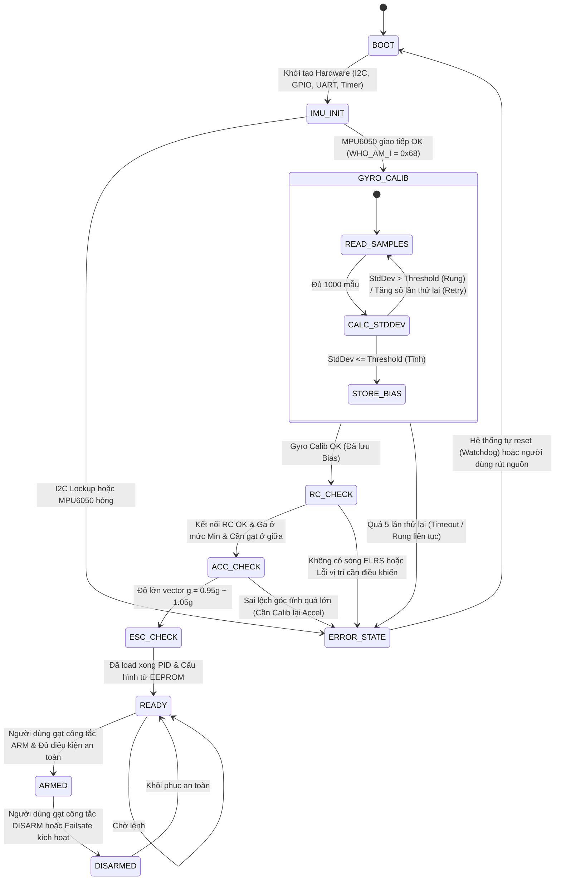

# Đặc tả Hiệu chuẩn Khởi động & Kế hoạch Phát triển v3 (Startup Calibration Plan v3)

Tài liệu này thiết kế chi tiết cơ chế Hiệu chuẩn Khởi động (Startup Calibration Specification) và quản lý trạng thái an toàn trước khi Arm động cơ cho Drone Quadcopter sử dụng **STM32F103C8T6** và **MPU6050** (giao thức ELRS CRSF). Đồng thời, tài liệu đánh giá khách quan hiện trạng mã nguồn hiện tại của bạn để vạch ra lộ trình triển khai tiếp theo.

---

## I. Phân loại Cơ chế Hiệu chuẩn (Calibration Classification)

### 1. Hiệu chuẩn bắt buộc mỗi lần khởi động (Startup Calibration)
Đây là các bước kiểm tra động và đo lường bắt buộc phải thực hiện mỗi khi cắm pin cấp nguồn để đảm bảo an toàn bay.

*   **Gyroscope Zero Bias (Hiệu chuẩn điểm không của Gyro):**
    *   *Mục đích:* Loại bỏ độ trôi nhiệt và sai lệch tĩnh (bias) của Gyroscope. Nếu không làm, drone sẽ tự động xoay (drift) liên tục dù không gạt cần.
    *   *Thuật toán:* Đọc liên tiếp $N$ mẫu Gyro (tần số 1kHz), tính trung bình cộng sai số trên 3 trục ($X, Y, Z$) và trừ giá trị trung bình này vào kết quả đọc thời gian thực.
    *   *Điều kiện Pass:* Drone nằm hoàn toàn tĩnh lặng. Độ lệch chuẩn (StdDev) của các mẫu đọc nhỏ hơn ngưỡng cấu hình.
    *   *Điều kiện Fail:* Rung động quá mức (do gió, chạm tay vào drone khi cắm pin).
    *   *Cách xử lý:* Báo lỗi, chuyển sang trạng thái lỗi `CALIBRATION_FAILED_IMU_MOVING`, chặn hoàn toàn việc ARM và thử lại (Retry) khi phát hiện drone đã tĩnh.
*   **RC Center Offset (Hiệu chuẩn điểm giữa tay điều khiển):**
    *   *Mục đích:* Đảm bảo khi không gạt cần (cần ở giữa), giá trị các kênh Roll, Pitch, Yaw phải đạt chính xác mức tham chiếu (ví dụ: $1500\mu\text{s}$).
    *   *Thuật toán:* Đọc giá trị 3 kênh đầu vào khi khởi động, tính toán độ lệch (offset) so với trung tâm $1500\mu\text{s}$. Nếu lệch nhẹ (trong phạm vi Deadband $\pm 20\mu\text{s}$), hệ thống tự động ghi nhận giá trị hiện tại làm tâm mới.
    *   *Điều kiện Pass:* Cần điều khiển ở vị trí trung tâm lúc boot.
    *   *Điều kiện Fail:* Người dùng vô tình chạm/gạt cần lúc bật nguồn. Báo lỗi `RC_CENTER_ERROR`.
*   **Throttle Minimum Detection (Kiểm tra ga ở mức tối thiểu):**
    *   *Mục đích:* Chặn việc motor tự quay rú ga đột ngột lúc khởi động nếu cần ga đang ở mức cao.
    *   *Thuật toán:* So sánh kênh Throttle thô thu được từ CRSF với ngưỡng an toàn tối thiểu ($1050\mu\text{s}$).
    *   *Điều kiện Pass:* $Throttle \le 1050\mu\text{s}$.
    *   *Điều kiện Fail:* $Throttle > 1050\mu\text{s}$. Báo lỗi `THROTTLE_NOT_MIN` và chặn ARM.
*   **MPU Stability Check (Kiểm tra độ ổn định cảm biến):**
    *   *Mục đích:* Xác nhận cảm biến MPU6050 đã hoàn tất quá trình khởi động nội bộ và sẵn sàng cung cấp dữ liệu ổn định (không bị trôi lớn).
    *   *Thuật toán:* Kiểm tra sự thay đổi giá trị góc Roll/Pitch ước lượng trong 200ms đầu tiên. Nếu sự thay đổi góc vượt quá $0.5^\circ/\text{s}$, hệ thống coi là chưa ổn định.

---

### 2. Hiệu chuẩn chỉ thực hiện một lần (One-time Calibration)
Các tham số hiệu chuẩn này mang tính chất cơ lý học của phần cứng, chỉ cần làm một lần duy nhất và lưu trữ vào bộ nhớ không bay hơi (**EEPROM 24LC256** và **Flash nội backup**). Chúng được kích hoạt thông qua macro `CALIBRATION_MODE` trong [config.h](file:///d:/Duong/Drone/drone_hehe/drone_fw/include/config.h) và điều khiển từ xa bằng công tắc **CH5 (AUX 1)** trên tay điều khiển:

*   **ESC Calibration (Hiệu chuẩn hành trình ga ESC) [`CALIBRATION_MODE == 1`]:**
    *   *Kịch bản:* 
        1. Bật sẵn tay điều khiển, gạt công tắc **CH5 > 1750µs** (mức cao).
        2. Cắm pin cấp nguồn đồng thời cho drone (STM32 + ESC cùng khởi động).
        3. Do phát hiện `CALIBRATION_MODE == 1` và `CH5 > 1750µs`, ngay khi khởi động xong Driver Motor, STM32 sẽ lập tức phát xung **2000µs** ra cả 4 động cơ.
        4. Chờ 5 giây để ESC bíp nhận điểm ga tối đa. Sau đó, người dùng gạt công tắc **CH5 <= 1750µs** (mức thấp).
        5. STM32 phát hiện `CH5` giảm và sẽ chuyển sang phát xung **1000µs** ra các ESC.
        6. Đợi ESC bíp xác nhận hoàn tất. Rút pin để kết thúc.
    *   *Dữ liệu lưu trữ:* Lưu trực tiếp vào EEPROM nội của ESC (không lưu trên STM32).
*   **Accelerometer Offset (Hiệu chuẩn gia tốc kế) [`CALIBRATION_MODE == 2`]:**
    *   *Kịch bản:*
        1. Đặt drone nằm tĩnh lặng trên một mặt phẳng cân bằng thủy chuẩn hoàn hảo.
        2. Bật drone và tay điều khiển, gạt công tắc **CH5 <= 1750µs** (mức thấp).
        3. Khi sẵn sàng, gạt công tắc **CH5 > 1750µs** (mức cao).
        4. MCU phát hiện tín hiệu kích hoạt, bắt đầu đọc 4000 mẫu gia tốc kế (tần số 1kHz), tính toán offset sao cho giá trị đo được trên trục X, Y bằng $0.0\text{g}$ và trục Z bằng chính xác $1.0\text{g}$ ($4096 \text{ LSB}$ ở dải $\pm 8\text{g}$).
        5. MCU tự động **lưu các giá trị Accel Offset này vào EEPROM 24LC256** và **Flash nội Page 63** làm backup, sau đó chớp LED báo hiệu thành công.
    *   *Dữ liệu lưu trữ:* 3 số nguyên 16-bit ($a_x, a_y, a_z$ offset) lưu song song ở EEPROM ngoài và Flash nội.


---

## II. Sơ đồ Máy Trạng thái Khởi động (Startup State Machine)

Hệ thống điều khiển bay sẽ khởi động theo mô hình máy trạng thái hữu hạn (FSM) tuần tự và chặt chẽ:



### Chi tiết các trạng thái chuyển đổi & Phân loại cơ chế kiểm tra:

1.  **BOOT $\rightarrow$ IMU_INIT:** Khởi động ngoại vi (GPIO, UART, I2C, Timer).
2.  **IMU_INIT $\rightarrow$ GYRO_CALIB:** Giao tiếp MPU6050 thành công. Nếu lỗi $\rightarrow$ `ERROR_STATE`.
3.  **GYRO_CALIB [HIỆU CHUẨN MỖI LẦN KHỞI ĐỘNG]:** 
    *   *Hành vi:* MCU trực tiếp đo 1000 mẫu Gyro thô lúc tĩnh để tính toán offset điểm không (Zero Bias Offset).
    *   *Yêu cầu:* Drone phải nằm hoàn toàn tĩnh lặng. Nếu phát hiện rung động (StdDev vượt ngưỡng) $\rightarrow$ Thử lại tối đa 5 lần, quá 5 lần $\rightarrow$ `ERROR_STATE` (Lỗi `CALIBRATION_FAILED_IMU_MOVING`).
4.  **RC_CHECK:** Kiểm tra kết nối sóng ELRS (CRSF) và kiểm tra an toàn vị trí cần điều khiển (Roll, Pitch, Yaw ở trung tâm $1500 \pm 20\mu\text{s}$, Throttle dưới $1050\mu\text{s}$). Nếu sai lệch $\rightarrow$ `ERROR_STATE` (Mã lỗi tương ứng).
5.  **ACC_CHECK [SỬ DỤNG DỮ LIỆU HIỆU CHUẨN 1 LẦN]:** 
    *   *Hành vi:* **Không tự động hiệu chuẩn lại gia tốc kế** để tránh sai lệch khi drone bị đặt nghiêng lúc cắm pin. MCU chỉ **tải (load) các giá trị Accelerometer Offset đã lưu từ EEPROM/Flash** (đã calib 1 lần trước đó trên mặt phẳng chuẩn) để áp dụng.
    *   *Kiểm tra:* Đọc dữ liệu Accel sau bù, tính toán tổng vector $G_{\text{total}} = \sqrt{a_x^2 + a_y^2 + a_z^2}$. Giá trị phải nằm trong dải tĩnh an toàn $0.95\text{g} \sim 1.05\text{g}$. Nếu vượt dải $\rightarrow$ `ERROR_STATE` (Lỗi `IMU_ERROR`).
6.  **ESC_CHECK [SỬ DỤNG DỮ LIỆU HIỆU CHUẨN 1 LẦN]:**
    *   *Hành vi:* **Không tự chạy quy trình Calib ESC** (vì quy trình này phát xung Max-Min rất nguy hiểm). MCU chỉ đọc cờ `esc_calibrated` trong EEPROM/Flash để xác nhận bạn đã thực hiện hiệu chuẩn hành trình ga ESC 1 lần trước đó chưa. Nếu chưa $\rightarrow$ Cảnh báo hoặc chặn ARM, yêu cầu thực hiện calib ESC thủ công qua CLI.
7.  **READY $\rightarrow$ ARMED:** Hệ thống sẵn sàng bay, cho phép Arm động cơ khi nhận lệnh.

---

## III. Phân tích Thuật toán & Đánh giá Hiện trạng Code (Checklist v3)

Dưới đây là bảng đánh giá khách quan về những gì **Drone FW hiện tại đã có** và **những gì cần bổ sung** để đạt được Đặc tả thiết kế trên:

### 1. Phân hệ Gyroscope Calibration (Mục 4)
*   [x] **Lấy tối thiểu 1000 mẫu ở tần số 1kHz:** Hiện tại hàm `mpu6050Calibrate()` trong [mpu6050.cpp](file:///d:/Duong/Drone/drone_hehe/drone_fw/src/driver/mpu6050.cpp#L89) đã lấy **2000 mẫu** với chu kỳ trễ $1000\mu\text{s}$ ($1\text{ms}$ tương đương $1\text{kHz}$), vượt chỉ tiêu yêu cầu.
*   [x] **Tính offset trung bình:** Đã thực hiện cộng dồn và chia trung bình để tìm bias của 3 trục Gyro và Accel Z.
*   [ ] **Tự động phát hiện rung động (StdDev Detection):**
    *   *Hiện trạng:* Chưa có. Code hiện tại chỉ cộng dồn thô mà không kiểm tra độ lệch chuẩn của các mẫu. Nếu drone bị rung lắc trong 2 giây calib này, offset tính ra sẽ bị sai lệch nghiêm trọng dẫn đến drone bị tự trôi/lật khi bay.
    *   *Giải pháp cần code:* Bổ sung thuật toán tính phương sai/độ lệch chuẩn động:
        $$\sigma = \sqrt{\frac{\sum (x_i - \mu)^2}{N}}$$
        Nếu $\sigma_{\text{gyro}} > \text{Threshold}$ (ví dụ: $0.2^\circ/\text{s}$), trả về mã lỗi `CALIBRATION_FAILED_IMU_MOVING` và yêu cầu hiệu chuẩn lại.

### 2. Phân hệ Accelerometer Validation (Mục 5)
*   [ ] **Kiểm tra độ lớn vector gia tốc tĩnh ($0.95\text{g} \sim 1.05\text{g}$):**
    *   *Hiện trạng:* Chưa có. Drone FW hiện tại chỉ đọc thô và quy đổi đơn vị mà không kiểm tra tính toàn vẹn vật lý của gia tốc trọng trường khi đứng yên.
    *   *Giải pháp cần code:* Sau khi load offset của Accelerometer từ EEPROM, thực hiện tính toán:
        $$G_{\text{total}} = \sqrt{a_x^2 + a_y^2 + a_z^2}$$
        Nếu $G_{\text{total}} < 0.95$ hoặc $G_{\text{total}} > 1.05$ (đơn vị $\text{g}$), báo lỗi `IMU_ERROR` và khóa chặt không cho phép ARM. Điều này ngăn chặn việc bay khi cảm biến bị lệch trục hoặc lắp đặt sai góc.

### 3. Phân hệ Receiver Validation (Mục 6)
*   [x] **Kiểm tra ga ở mức tối thiểu khi Arm:** Trong [safety.cpp](file:///d:/Duong/Drone/drone_hehe/drone_fw/src/middleware/safety.cpp#L65) đã kiểm tra `throttle < 1050`.
*   [ ] **Kiểm tra Roll/Pitch/Yaw $\approx 1500$ lúc khởi động:**
    *   *Hiện trạng:* Chưa có. Hệ thống chưa kiểm tra xem các cần điều khiển có đang bị lệch tâm lúc boot hay không.
    *   *Giải pháp cần code:* Tại bước `RC_CHECK` trong FSM, đọc các kênh:
        *   Nếu $|Roll - 1500| > 20\mu\text{s}$ hoặc $|Pitch - 1500| > 20\mu\text{s}$ hoặc $|Yaw - 1500| > 20\mu\text{s}$, báo lỗi `RC_CENTER_ERROR` và không cho phép ARM.
        *   Nếu $Throttle > 1050\mu\text{s}$ lúc khởi động, báo lỗi `THROTTLE_NOT_MIN`.

### 4. Phân hệ Arming Safety Checklist (Mục 7)
*   [x] **Receiver Connected:** Đã kiểm tra qua `crsfIsLinkActive()`.
*   [x] **Throttle Minimum:** Đã kiểm tra `throttle < 1050`.
*   [x] **Battery Voltage Valid:** Đã kiểm tra `bat_state != BATTERY_CRITICAL`.
*   [x] **IMU Hardware OK:** Đã kiểm tra `imu_error_counter == 0`.
*   [ ] **Gyro Calibration OK:** Chưa có cờ logic kiểm tra trạng thái này (hiện tại mặc định coi là OK sau khi chạy xong `setup`).
*   [ ] **PID Initialized Check:** Chưa có kiểm tra cờ khởi tạo vòng lặp điều khiển PID trước khi cho phép ARM.

### 5. Cấu trúc lưu trữ EEPROM 24LC256 (Mục 2)
*   [x] **Driver EEPROM 24LC256:** Đã có driver đọc ghi đầy đủ trong [eeprom_24lc256.cpp](file:///d:/Duong/Drone/drone_hehe/drone_fw/src/driver/eeprom_24lc256.cpp) thông qua Soft I2C.
*   [ ] **Cấu trúc dữ liệu lưu trữ (Config Struct):**
    *   *Hiện trạng:* Chưa định nghĩa rõ ràng cấu trúc dữ liệu lưu trữ các offset cảm biến và thông số PID trên EEPROM.
    *   *Giải pháp cần code:* Thiết kế cấu trúc struct thống nhất để ghi/đọc một khối (block) duy nhất từ EEPROM lúc khởi động và tắt máy:
        ```cpp
        struct DroneConfig {
          uint32_t signature;       // Để kiểm tra dữ liệu hợp lệ (ví dụ: 0xDEADBEEF)
          // PID Parameters
          float kp_roll, ki_roll, kd_roll;
          float kp_pitch, ki_pitch, kd_pitch;
          float kp_yaw, ki_yaw, kd_yaw;
          // Accel Offsets (One-time Calib)
          int16_t accel_offset_x;
          int16_t accel_offset_y;
          int16_t accel_offset_z;
          // Gyro Offsets (One-time Calib / Factory Default)
          int16_t gyro_offset_x;
          int16_t gyro_offset_y;
          int16_t gyro_offset_z;
          uint8_t esc_calibrated;   // Cờ trạng thái đã Calib ESC
          uint8_t crc8;             // Kiểm tra tính toàn vẹn dữ liệu
        };
        ```

---

## IV. Cơ chế Dự phòng Lưu trữ kép (Dual-Storage Backup Mechanism: EEPROM + Flash nội)

Để tăng độ tin cậy và tạo bản backup tự động khi bạn thay đổi chip STM32 hoặc thay module EEPROM mới, chúng ta thiết kế cơ chế lưu trữ kép như sau:

### 1. Phân bổ vùng nhớ Flash nội (Internal Flash) của STM32F103C8T6
*   Sử dụng **Page 63** (Page cuối cùng từ địa chỉ `0x0800FC00` đến `0x0800FFFF` trong dải Flash 64KB) làm vùng lưu trữ cấu hình backup. 
*   Vùng nhớ này hoàn toàn nằm ngoài vùng biên dịch code của chương trình để tránh bị ghi đè.

### 2. Thuật toán đọc cấu hình lúc khởi động (Boot Sync Flow)
Khi drone bật nguồn, quá trình đọc cấu hình diễn ra theo các bước sau:
1.  **Bước 1: Đọc từ EEPROM ngoài (Ưu tiên số 1)**
    *   MCU đọc struct `DroneConfig` từ EEPROM qua I2C và kiểm tra tính toàn vẹn bằng `crc8` và `signature`.
    *   *Trường hợp 1 (EEPROM OK):* Áp dụng cấu hình này và đồng thời kiểm tra/ghi đè bản sao lưu vào Flash nội (nếu Flash nội bị trống hoặc lệch dữ liệu).
    *   *Trường hợp 2 (EEPROM HỎNG / TRỐNG):* Chuyển sang Bước 2.
2.  **Bước 2: Đọc từ Flash nội (Bản sao lưu Backup)**
    *   MCU đọc `DroneConfig` từ Page 63 của Flash nội STM32, kiểm tra `crc8` và `signature`.
    *   *Trường hợp 1 (Flash OK):* Áp dụng cấu hình và **tự động khôi phục (ghi đè) sang EEPROM ngoài** (đề phòng trường hợp bạn vừa thay module EEPROM mới).
    *   *Trường hợp 2 (Flash HỎNG / TRỐNG):* Chuyển sang Bước 3.
3.  **Bước 3: Khôi phục cấu hình mặc định (Default Failback)**
    *   Sử dụng các giá trị PID và Offset mặc định được nạp cứng (hardcode) trong code ban đầu.

### 3. Thuật toán ghi cấu hình (Save Flow)
Mỗi khi người dùng thực hiện lệnh lưu (ví dụ qua tay điều khiển CH5 hoặc CLI):
1.  Ghi dữ liệu mới vào EEPROM ngoài.
2.  Thực hiện xóa Page 63 của Flash nội STM32, sau đó ghi dữ liệu cấu hình vào Flash nội để cập nhật bản sao lưu.

---

## V. Kế hoạch Hành động v3 (Lộ trình Triển khai Code)

Để hiện thực hóa Đặc tả này vào dự án Drone FW, chúng ta cần chỉnh sửa các file mã nguồn theo thứ tự logic sau:

1.  **Bước 1: Thiết kế Cấu hình và Cấu trúc Lưu trữ**
    *   Định nghĩa `DroneConfig` struct trong [config.h](file:///d:/Duong/Drone/drone_hehe/drone_fw/include/config.h) hoặc `eeprom_24lc256.h`.
    *   Bổ sung các định nghĩa mã lỗi (Error Codes) cho quá trình chớp LED chẩn đoán (VD: 1 chớp = Lỗi I2C, 2 chớp = Lỗi di chuyển IMU, 3 chớp = Lỗi RC...).
2.  **Bước 2: Cải tiến Driver MPU6050**
    *   Sửa đổi `mpu6050Calibrate()` trong [mpu6050.cpp](file:///d:/Duong/Drone/drone_hehe/drone_fw/src/driver/mpu6050.cpp) để tính toán độ lệch chuẩn của Gyro trong quá trình lấy mẫu.
    *   Viết hàm kiểm tra độ lớn vector $G_{\text{total}}$ tĩnh của Accel.
    *   Tích hợp hàm ghi/đọc offset cảm biến vào/ra EEPROM.
3.  **Bước 3: Tích hợp FSM Startup vào Safety & Main Loop**
    *   Chuyển đổi luồng khởi động trong `setup()` và `loop()` của [main.cpp](file:///d:/Duong/Drone/drone_hehe/drone_fw/src/main.cpp) thành một máy trạng thái FSM tuần tự phi chặn.
    *   Thêm cơ chế kiểm tra tay điều khiển (Roll, Pitch, Yaw ở trung tâm, Throttle ở đáy) tại trạng thái `RC_CHECK`.
4.  **Bước 4: Nâng cấp Arming Safety Checklist**
    *   Cập nhật hàm `safetyUpdate()` để kiểm tra toàn bộ các cờ điều kiện: Gyro Calib OK, IMU Stable, RC Active, Throttle Min, Battery Valid, PID Init.

